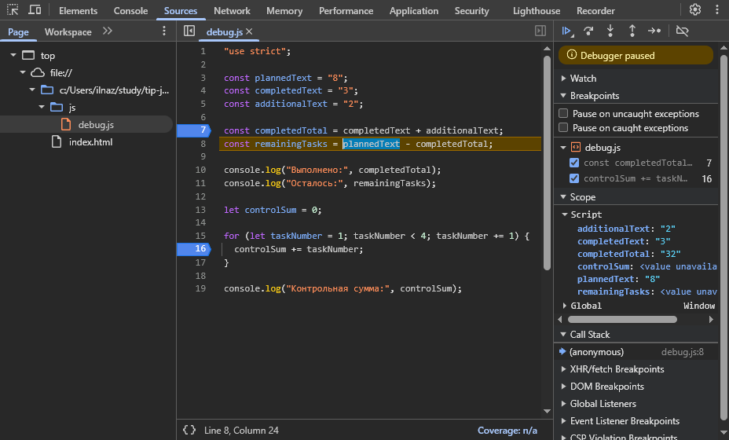

# Практическая работа № 1

## 1. Автор и вариант

- Имя: Назаров Илья
- Группа: ЭФБО-13-25
- Вариант: 7 (totalTasks = 10, completedTasks = 7, dailyLimit = 3)

## 2. Окружение

- ОС: Windows 10
- Node.js: v24.21.0
- npm: 11.19.0
- Git: 2.55.0.windows.5
- Браузер: Chrome 154

## 3. Запуск

Из корня репозитория:

    node practice-01/js/hello.js
    node practice-01/js/types.js
    node practice-01/js/progress.js
    node practice-01/js/plan.js
    node practice-01/js/debug.js

В браузере: открыть `practice-01/index.html`, заменить путь в `script`
на нужный файл, сохранить, перезагрузить страницу, посмотреть Console.

## 4. Задание 1 — две среды выполнения

- Node.js: `typeof document` → `undefined`
- Браузер: `typeof document` → `object`
- Объяснение: 

    Node.js — это среда выполнения JavaScript вне браузера. У неё нет доступа к DOM (объектной модели страницы), поэтому объект document не существует, и typeof document возвращает "undefined".

    Браузер, кроме самого языка, предоставляет набор встроенных API для работы со страницей — DOM, document, window, fetch и другие. Поэтому в браузере document — реальный объект, и typeof document даёт "object".

    Один и тот же код запускается в двух средах, но результат различается, потому что среда решает, какие объекты доступны программе.

## 5. Задание 2 — типы и преобразования

| №  | Выражение          | Ожидание | Факт   | Тип     | Объяснение                       |
|---:|--------------------|----------|--------|---------|----------------------------------|
| 1  | `"8" + 2`          | "82"     | 82     | string  | конкатенация со строкой          |
| 2  | `"8" - 2`          | 6        | 6      | number  | оператор `-` приводит к числу    |
| 3  | `Number("8") + 2`  | 10       | 10     | number  | явное преобразование             |
| 4  | `"12" > "3"`       | false    | false  | boolean | строки сравниваются посимвольно  |
| 5  | `12 === "12"`      | false    | false  | boolean | строгое равенство без приведения |
| 6  | `Number("")`       | 0        | 0      | number  | пустая строка → 0                |
| 7  | `Number("text")`   | NaN      | NaN    | number  | нечисло, тип остаётся number     |
| 8  | `Boolean("false")` | true     | true   | boolean | непустая строка → true           |
| 9  | `typeof null`      | "object" | object | string  | историческая особенность         |
| 10 | `typeof NaN`       | "number" | number | string  | NaN — числовой тип               |

## 6. Задание 3 — сводка выполнения задач

| Проверка             | Вход (total / completed) | Ожидание                   | Факт                            | Итог     |
|----------------------|--------------------------|----------------------------|---------------------------------|----------|
| Обычный случай       | 12 / 5                   | 7 ост., 41.7%, «В работе»  | Осталось 7 / 41.7% / В работе   | Пройдено |
| Нет задач            | 0 / 0                    | «Задач пока нет»           | Задач пока нет                  | Пройдено |
| Ничего не сделано    | 5 / 0                    | 5 ост., 0.0%, «Не начато»  | Осталось 5 / 0.0% / Не начато   | Пройдено |
| Всё сделано          | 5 / 5                    | 0 ост., 100.0%, «Завершено»| Осталось 0 / 100.0% / Завершено | Пройдено |
| Больше, чем есть     | 5 / 6                    | Ошибка                     | Ошибка                          | Пройдено |
| Отрицательное        | -1 / 0                   | Ошибка                     | Ошибка                          | Пройдено |
| Дробное              | 5 / 2.5                  | Ошибка                     | Ошибка                          | Пройдено |
| Строка вместо числа  | "5" / 2                  | Ошибка                     | Ошибка                          | Пройдено |
| Выше верхней границы | 1001 / 0                 | Ошибка                     | Ошибка                          | Пройдено |
| NaN                  | NaN / 0                  | Ошибка                     | Ошибка                          | Пройдено |

## 7. Задание 4 — план по дням

| Проверка             | Вход (tot / comp / lim) | Ожидание                    | Факт                    | Итог     |
|----------------------|-------------------------|-----------------------------|-------------------------|----------|
| Обычный случай       | 12 / 5 / 3              | 3 дня, последний — 1 задача | 3 дня, посл. — 1 задача | Пройдено |
| Ровно по лимиту      | 10 / 4 / 3              | 2 дня по 3                  | 2 дня по 3              | Пройдено |
| Лимит больше остатка | 5 / 3 / 10              | 1 день, 2 задачи            | 1 день, 2 задачи        | Пройдено |
| Всё выполнено        | 5 / 5 / 2               | 0 дней                      | 0 дней                  | Пройдено |
| Пустой ввод          | 0 / 0 / 2               | 0 дней                      | 0 дней                  | Пройдено |
| Нулевой лимит        | 5 / 2 / 0               | Ошибка                      | Ошибка                  | Пройдено |
| Дробный лимит        | 5 / 2 / 1.5             | Ошибка                      | Ошибка                  | Пройдено |
| completed > total    | 5 / 6 / 2               | Ошибка                      | Ошибка                  | Пройдено |
| Лимит строкой        | 5 / 2 / "2"             | Ошибка                      | Ошибка                  | Пройдено |
| Лимит выше границы   | 5 / 2 / 1001            | Ошибка                      | Ошибка                  | Пройдено |

## 8. Отладка

### Исходный вывод (до исправления)

Выполнено: 32
Осталось: -24
Контрольная сумма: 6

### Исправленный вывод

Выполнено: 5
Осталось: 3
Контрольная сумма: 10

### Причины ошибок

| Ошибка | Что наблюдалось | Причина | Исправление | Результат |
|---|---|---|---|---|
| Обработка количества задач | `completedTotal = "32"` (string) | Оператор `+` со строками выполняет конкатенацию, а не сложение | Добавлено `Number(...)` перед обоими операндами | `completedTotal = 5` (number) |
| Граница цикла | Сумма = 6, в цикле только 1, 2, 3 | Условие `taskNumber < 4` не включает 4 | Заменено на `taskNumber <= 4` | Сумма = 10 |

### Иллюстрация отладки

На скриншоте выполнение остановлено перед вычислением `remainingTasks`
(строка 8). В панели Scope видно:

- `completedText` = `"3"` (string), `additionalText` = `"2"` (string) —
  операнды являются строками, поэтому оператор `+` на строке 7 выполнил
  конкатенацию;
- `completedTotal` = `"32"` (string) — результат склейки, а не арифметической
  суммы;
- `controlSum` = `6` — цикл на строке 15 уже завершился, не добавив 4,
  потому что условие `taskNumber < 4` ложно при `taskNumber = 4`.

Обе логические ошибки обнаружены без исключений в консоли — только через
пошаговое выполнение и анализ значений в отладчике.

## 9. Вывод

В ходе работы я:

- установил и проверил окружение: Node.js, npm, Git, браузер;
- создал Git-репозиторий и структуру папок для практических работ;
- запустил один и тот же JavaScript-файл в двух средах (Node.js и браузер)
  и объяснил разницу в `typeof document`;
- исследовал 10 выражений с разными типами и преобразованиями, научился
  предсказывать результат до запуска;
- реализовал расчёт сводки выполнения задач с полной проверкой входных
  данных (тип, целочисленность, диапазон, граничный случай 0/0);
- реализовал пошаговое планирование оставшихся задач через цикл `while`
  с корректной обработкой последнего дня;
- научился находить логические ошибки через точки останова, панель Scope
  и пошаговое выполнение в Chrome DevTools.

Наиболее показательной оказалась ошибка со сложением строк: программа
не падала, но результат был неверным. Это подтверждает, что одного запуска
и чтения кода недостаточно — нужна проверка типов через отладчик.