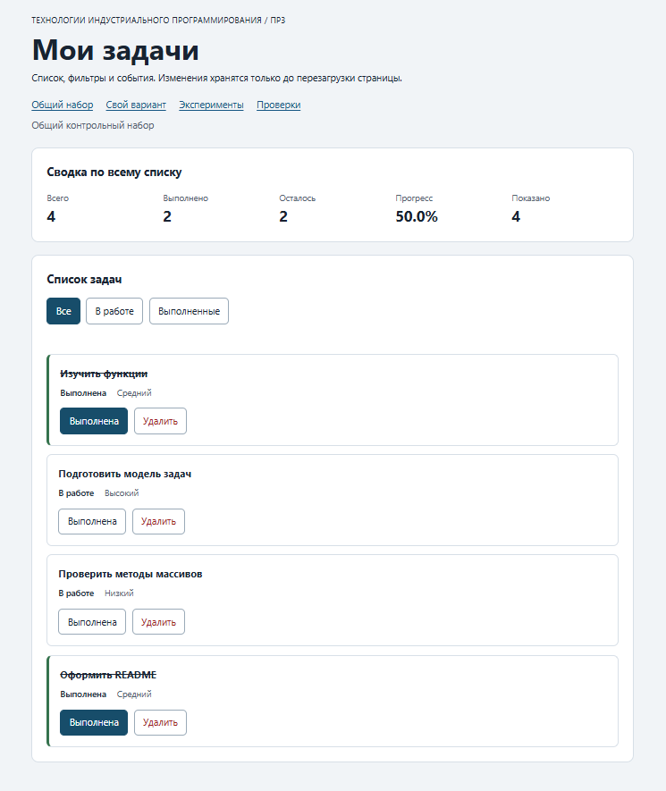

# Практическая работа № 3

**Тема:** Работа с DOM и событиями

## 1. Автор и вариант

- Имя: Назаров Илья
- Группа: ЭФБО-13-25
- Вариант из ПР2: 7 (тема «Подготовка учебного релиза», K = 6)

## 2. Окружение

- ОС: Windows 10
- Node.js: v24.21.0
- npm: 11.19.0
- Git: 2.55.0.windows.5
- Браузер: Chrome 154

## 3. Запуск

Рабочая папка: `practice-03` внутри личного репозитория.

Из папки `practice-03`:

    npm run check:service
    npm start

Устанавливать зависимости через `npm install` не требуется. Для PowerShell
при блокировке `npm.ps1` доступны `npm.cmd` и прямые команды `node`.

Адреса после запуска сервера:

    http://127.0.0.1:5503/
    http://127.0.0.1:5503/index.html?dataset=variant
    http://127.0.0.1:5503/examples/dom-events.html
    http://127.0.0.1:5503/checks.html

Остановка сервера: `Ctrl+C`. Если порт занят, запускается другой:
`node tools/serve.mjs 5504` — тогда во всех адресах используется `5504`.

## 4. Что перенесено из ПР2

Из ПР2 без изменений перенесены `src/task-service.js` (девять прикладных
функций) и `src/data.js` (общий набор и вариант 7: шесть задач с id
`[11, 23, 37, 41, 58, 64]`, все изначально выполнены). Повторная проверка
через `npm run check:service` даёт 35 пройденных сценариев. Исправлений
не потребовалось. `main.js` из ПР2 не переносился: там был консольный
сценарий, здесь — управление интерфейсом.

## 5. Эксперименты

Прогноз фиксировался до запуска каждого действия, проверка выполнялась
в DevTools Console.

| № | До запуска: прогноз | После запуска: результат | Объяснение |
|---:|---|---|---|
| 1. Отсутствующий элемент и коллекция | `null`; длина пустого `NodeList` = `0`; обращение к свойству `null` даст ошибку | `null`, `0`; обращение вызывает `TypeError` | `querySelector` возвращает `null`, если совпадений нет. `querySelectorAll` возвращает пустой `NodeList`, но не `null`. Перед обращением к `null` нужна проверка. |
| 2. dataset и числовой id | Строка `"23"`, затем число `23` | `"23"` (string), затем `23` (number) | `dataset` хранит значения как строки. `Number()` даёт настоящее число, пригодное для `findTaskById` и `Number.isSafeInteger`. |
| 3. Статический NodeList | Старый `NodeList` не изменится, новый покажет больше элементов | `initialItems.length` = 1; новый `querySelectorAll` = 2 | `querySelectorAll` возвращает статический снимок. Чтобы увидеть новые элементы, нужен новый запрос. |
| 4. Строка с HTML-разметкой | На странице будет видна строка `<strong>Это текст, а не HTML</strong>` целиком | Именно так; внутри заголовка нет элемента `<strong>` | `textContent` назначает текстовое содержимое и не разбирает строку как HTML. |
| 5. Распространение события | Журнал покажет три записи: `phase=1` (захват на `card`), `phase=2` (цель — `button`), `phase=3` (всплытие на `card`) | Совпадает; на первой и третьей записи `target` — `lab-button`, `currentTarget` — `lab-card`; на второй и то, и другое — `lab-button` | Порядок: захват (1) → цель (2) → всплытие (3). Обработчик на родителе тоже получает событие, потому что оно всплывает. |

## 6. Организация кода

- `task-service.js` — девять прикладных функций ПР2; обращений к `document` нет.
- `task-selectors.js` — `getVisibleTasks(tasks, filter)` для трёх режимов.
- `task-view.js` — создание карточки, отрисовка списка, сводки и пустого состояния; состояние приложения не меняется.
- `main.js` — текущее состояние (`currentTasks`, `currentFilter`), делегированные обработчики и вызовы сервиса.

Полный список хранится в `currentTasks` (внутри `main.js`), выбранный фильтр —
в `currentFilter`. Обработчик клика по списку — `handleTaskListClick` на
`#task-list`, обработчик фильтра — `handleFilterClick` на `#task-filters`.
Сводка вычисляется в `renderSummary` через `getTaskStats(currentTasks)`
по полному массиву, а «Показано» — по длине отфильтрованной выборки.

## 7. Общий сценарий

| Шаг | Видимые id | Всего | Выполнено | Осталось | Прогресс | Показано | Сообщение | Совпало с ожиданием |
|---:|---|---|---|---|---|---|---|---|
| 0 | [1, 4, 7, 10] | 4 | 2 | 2 | 50.0% | 4 | — | Да |
| 1 | [4, 7] | 4 | 2 | 2 | 50.0% | 2 | — | Да |
| 2 | [7] | 4 | 3 | 1 | 75.0% | 1 | — | Да |
| 3 | [1, 4, 7, 10] | 4 | 3 | 1 | 75.0% | 4 | — | Да |
| 4 | [1, 4, 10] | 3 | 3 | 0 | 100.0% | 3 | — | Да |
| 5 | [] | 3 | 3 | 0 | 100.0% | 0 | Нет задач по выбранному фильтру. | Да |
| 6 | [1, 4, 10] | 3 | 2 | 1 | 66.7% | 3 | — | Да |
| 7 | [] | 0 | 0 | 0 | 0.0% | 0 | Список задач пуст. | Да |

После перезагрузки страницы состояние возвращается к шагу 0: изменения в ПР3
не сохраняются между загрузками.

## 8. Индивидуальный вариант

Тема: «Подготовка учебного релиза». Шесть задач с идентификаторами
`[11, 23, 37, 41, 58, 64]`, все изначально выполнены. Приоритеты покрывают
`low`, `medium` и `high`.

| Этап | Всего | Выполнено | Осталось | Прогресс | Видимые id |
|---|---|---|---|---|---|
| До действий | 6 | 6 | 0 | 100.0% | [11, 23, 37, 41, 58, 64] |
| После переключения 23 | 6 | 5 | 1 | 83.3% | [11, 23, 37, 41, 58, 64] |
| После удаления 37 | 5 | 5 | 0 | 100.0% | [11, 23, 41, 58, 64] |
| Итог, фильтр «В работе» | 5 | 5 | 0 | 100.0% | [] |
| Итог, фильтр «Выполненные» | 5 | 5 | 0 | 100.0% | [11, 23, 41, 58, 64] |

## 9. Проверки

### 9.1. Проверка сервиса

Команда из папки `practice-03`:

    npm run check:service

Ожидаемо: 35 пройденных сценариев, 0 ошибок.
Фактически пройдено: 35 из 35
Дата запуска и версия Node.js: Дата запуска и версия Node.js: 2026-10-04, v24.21.0

Фактический вывод прилагается текстовым блоком:

OK: 01. Создание задачи с явным приоритетом
OK: 02. Приоритет по умолчанию
OK: 03. Удаление краевых пробелов без изменения внутренних
OK: 04. Граничные длины названия и положительный безопасный id
OK: 05. Некорректные названия при создании
OK: 06. Некорректные идентификаторы при создании
OK: 07. Все допустимые приоритеты и отклонение недопустимых
OK: 08. Каждый вызов createTask возвращает новый объект
OK: 09. Поиск по id, а не по индексу
OK: 10. Отсутствующая задача и пустой массив при поиске
OK: 11. Поиск не преобразует строковый id в число
OK: 12. Получение невыполненных задач
OK: 13. Пустой список, все выполнены и все не выполнены
OK: 14. Названия в исходном порядке и пустой список
OK: 15. Сводка по общему набору
OK: 16. Сводка по пустому списку
OK: 17. Сводка: ничего не выполнено и выполнено всё
OK: 18. Процент остаётся числом без предварительного округления
OK: 19. Добавление в конец без изменения входного массива
OK: 20. Добавление в пустой список с приоритетом по умолчанию
OK: 21. Повторяющийся id отклоняется
OK: 22. Добавление не обходит проверки createTask
OK: 23. Изменение completed в обе стороны
OK: 24. completed принимает только boolean
OK: 25. Некорректный или отсутствующий id при изменении статуса
OK: 26. Повторная установка статуса создаёт новый результат
OK: 27. Переименование сохраняет остальные поля
OK: 28. Проверки названия при переименовании
OK: 29. Некорректный или отсутствующий id при переименовании
OK: 30. Удаление по id с сохранением порядка
OK: 31. Удаление единственной записи
OK: 32. Некорректный, отсутствующий id и удаление из пустого списка
OK: 33. Входные объекты не изменяются ни одной операцией
OK: 34. Общий сценарий и все промежуточные сводки
OK: 35. Работа с другим набором, без зависимости от demoTasks

Проверок пройдено: 35; не пройдено: 0.

### 9.2. Браузерные проверки

При работающем сервере открыть `http://127.0.0.1:5503/checks.html`.
Ожидаемо: 36 пройденных сценариев, 0 ошибок.
Фактически пройдено: 36 из 36

Фактический текст из блока «Текстовый протокол» прилагается:

OK: Фильтр all возвращает новый массив в исходном порядке
OK: Фильтр pending выбирает невыполненные задачи
OK: Фильтр completed выбирает выполненные задачи
OK: Все три фильтра работают с пустым списком
OK: Фильтрация не меняет входные записи и их порядок
OK: Карточка — li.task-card с числовым id в dataset
OK: Статус невыполненной карточки и aria-pressed согласованы
OK: Статус выполненной карточки и aria-pressed согласованы
OK: В карточке две обычные кнопки с вложенными подписями
OK: Все приоритеты отображаются по установленному словарю
OK: Название с разметкой отображается текстом
OK: Отрисовка списка создаёт карточки в исходном порядке
OK: Повторная отрисовка не накапливает карточки
OK: Контейнер списка и его обработчик сохраняются
OK: Отрисовка пустого массива очищает прежние карточки
OK: Сводка считается по всему списку, отдельно выводится Показано
OK: Пустая сводка не содержит NaN и Infinity
OK: Сообщение для полностью пустого списка
OK: Сообщение для пустого результата фильтра
OK: Появление карточек скрывает прежнее пустое состояние
OK: Приложение: начальный набор и сводка
OK: Приложение: фильтр срабатывает по клику на вложенный span
OK: Приложение: активный фильтр отмечен классом и aria-pressed
OK: Приложение: фильтрация не удаляет скрытые задачи
OK: Приложение: переключение по id, а не индексу массива
OK: Приложение: выполненная задача исчезает из фильтра В работе
OK: Приложение: удаление изменяет данные, а не только DOM
OK: Приложение: клик по названию не изменяет данные
OK: Приложение: после перерисовок одно нажатие — одно изменение
OK: Приложение: удаление всех записей и нулевая сводка
OK: Приложение: нет совпадений — не то же самое, что нет задач
OK: Приложение: неизвестный числовой id не меняет данные
OK: Приложение: id 4abc не превращается в 4
OK: Приложение: неизвестное действие игнорируется
OK: Приложение: после изменения сохраняется клавиатурный фокус
OK: Приложение: новая загрузка возвращает исходное состояние

Всего: 36. Пройдено: 36. Ошибок: 0.

### 9.3. Собственные проверки

| № | Исходное состояние и действия | Ожидаемый результат | Фактический результат | Итог |
|---:|---|---|---|---|
| 1 | Оставить в списке одну задачу, удалить её | `0 / 0 / 0 / 0.0% / 0`, сообщение «Список задач пуст.» | 0 / 0 / 0 / 0.0% / 0, сообщение появилось | Пройдено |
| 2 | Все задачи выполнены, фильтр «В работе» | Пустой список, сводка по полному массиву, сообщение «Нет задач по выбранному фильтру.» | Пустой список, сводка 4 / 4 / 0 / 100.0% / 0, сообщение появилось | Пройдено |
| 3 | Открыть `?dataset=variant`, переключить 23, удалить 37, переключить фильтры | Итог `5 / 5 / 0 / 100.0%`, id `[11, 23, 41, 58, 64]` | Совпало | Пройдено |

Проверка 1 — граничное состояние (пустой список). Проверка 2 — событие
и повторная отрисовка. Проверка 3 — индивидуальный вариант.

## 10. Отладка и клавиатура

Точка останова устанавливалась на строке чтения
`const id = Number(card.dataset.taskId);` в `handleTaskListClick`.
В момент остановки наблюдалось:

- `event.target` — вложенный `span.action-label`, на который пришёлся клик;
- `event.currentTarget` — `ul#task-list`, на котором зарегистрирован обработчик;
- `card.dataset.taskId` — строка `"4"` (тип `string`);
- `id` после `Number()` — число `4`;
- `action` — `"toggle"` или `"delete"`;
- результат сервиса — `{ ok: true, tasks: […] }`; при ошибке — `{ ok: false, error: "…" }`.

Клавиатура: после `Tab` фокус доходит до кнопок фильтров и действий,
`Enter`/`Space` активируют их. После изменения статуса фокус возвращается
на ту же кнопку действия; после удаления — на активный фильтр. Отказ
проверялся временной заменой `data-task-id` на `777` и `4abc`: сообщение
появляется в `#operation-message`, данные не изменяются.

## 11. Вид приложения

Изображение получено после собственного запуска.

## 12. Дополнительное задание

Не выполнялось.

## 13. Вывод

Приложение связывает готовые функции ПР2 с DOM: карточки создаются через
`createElement`, названия выводятся через `textContent`, действия
обрабатываются делегированно на `#task-list`. Изменение данных и изменение
DOM — разные операции: сначала вызывается сервис и обновляется
`currentTasks`, только потом `renderApp` пересобирает карточки. Удаление
DOM-узла без обновления массива вернуло бы задачу после перерисовки.

Отдельно проверено, что фильтр не уничтожает скрытые записи: `currentTasks`
всегда хранит полный массив, а видимая выборка рассчитывается через
`getVisibleTasks`. Общая сводка при этом считается по полному массиву,
а «Показано» — по отфильтрованному.

Наиболее показательным оказался эксперимент 4: `textContent` не разбирает
строку как HTML, и это подтверждает, что названия задач выводятся как
безопасный текст. Второй важный момент — статичность `NodeList`,
полученного через `querySelectorAll`: это объясняет, почему приложение
пересобирает карточки с нуля, а не полагается на старую коллекцию.